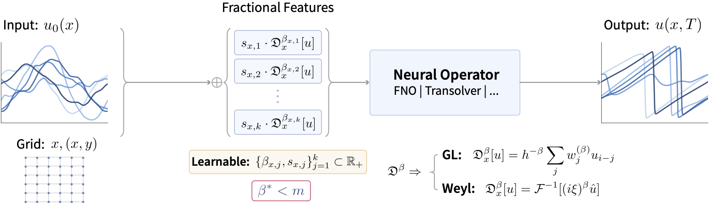
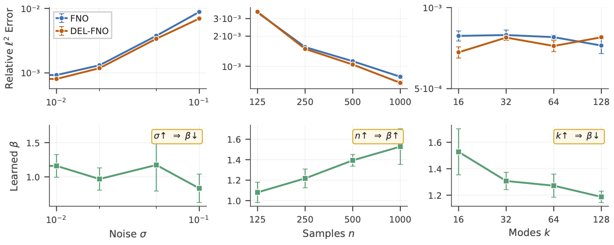
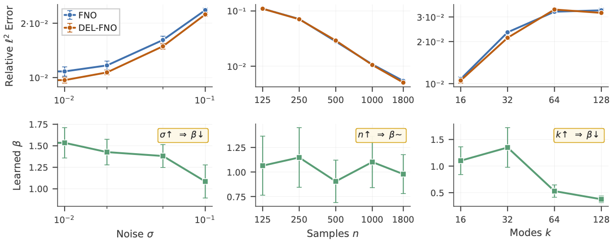

# 🌀 ∂-NO: Fractional is Better — Learnable Derivative Orders in Neural Operator Learning

[](https://icml.cc/Conferences/2026)
[](https://arxiv.org/)
[](https://opensource.org/licenses/MIT)
[](https://www.python.org/downloads/)
[](https://pytorch.org/)

**[Paper](https://openreview.net/forum?id=V4FDM692AZ) | [arXiv](https://arxiv.org/) | [Slides](https://icml.cc/) | [Poster](https://icml.cc/)**

## 🎯 TL;DR

**∂-NO (del-NO)** is a drop-in augmentation that injects **learnable fractional derivative features** into any neural operator backbone. Both the derivative orders $\beta_k$ and feature scales $s_k$ are jointly optimized with network weights via a differentiable Grünwald–Letnikov stencil. **The central finding:** the MSE-optimal derivative order $\beta^*$ is *strictly less* than the PDE order $m$, with the gap closed-form predicted by a spectral bias–variance tradeoff (Theorem 5.6).

<p align="center">
  
  <br>
  <em>∂-NO architecture: input <code>(x, u)</code> augmented with learnable fractional derivative features <code>D^β u</code> before any unchanged neural-operator backbone (FNO, Transolver, LocalNO, CNO, PINO, …)</em>
</p>


## Why ∂-NO

- **🔌 Drop-in** — wraps any backbone with no architectural change.
- **📐 Theory-grounded** — closed-form $\beta^* < m$, validated on Burgers (smooth and near-shock).
- **📊 Consistent gains** — 40/40 cells in the main table (5 PDEs × 4 backbones × 2 noise regimes); 120/120 under Gaussian + uniform stress noise; 14/14 for ∂-CNO; 8/8 for ∂-PINO.
- **🌀 Differentiable & light** — gradients flow through $\partial_\beta$; modest overhead and no extra hyperparameter search.

## The method, in one line

```python
# ∂-NO augmentation — wraps any backbone NO_theta
x_aug = torch.cat([x, u, *[s_k * D_beta_k(u) for k in range(K)]], dim=-1)
y     = NO_theta(x_aug)          # beta_k and s_k are learned end-to-end
```

Each `D_beta_k` is a Grünwald–Letnikov fractional derivative with a *learnable* order $\beta_k$ and *learnable* scale $s_k$. The implementation is included **inline** in every notebook — no heavy dependencies beyond what your backbone already needs.

## Notebooks

| Notebook | Shows | Runtime |
|---|---|---|
| [`Notebook1_del_NO.ipynb`](notebooks/Notebook1_del_NO.ipynb) | ∂-NO implementation + Burgers (ν=0.1): baseline vs ∂-FNO and the learnable-$\beta$ trajectory | ~5–10 min |
| [`Notebook2_betas_burgers_10.ipynb`](notebooks/Notebook2_betas_burgers_10.ipynb) | Theory validation on **smooth** Burgers (ν=0.1): learned $\beta^*$ vs noise $\sigma$, samples $n$, and modes $k$ — **reproduces Figure 2** | ~15–30 min |
| [`Notebook3_betas_burgers_1000.ipynb`](notebooks/Notebook3_betas_burgers_1000.ipynb) | Theory validation on **near-shock** Burgers (ν=0.001) — **reproduces Figure 3** | ~15–30 min |

```bash
pip install torch numpy matplotlib jupyter
jupyter notebook notebooks/Notebook1_del_NO.ipynb
```

The additional backbones (TFNO, LocalNO, Transolver) and benchmarks (Darcy, Navier–Stokes, KdV, the seven CNO problems, and 3D compressible Navier–Stokes) reported in the paper build on the [THUML Neural-Solver-Library](https://github.com/thuml/Neural-Solver-Library) and [CNO](https://github.com/bogdanraonic3/ConvolutionalNeuralOperator).

## Theory predicts how $\beta^*$ moves

<p align="center">
  
  <br>
  <em>Figure 2 — smooth Burgers (ν=0.1). $\sigma\uparrow \Rightarrow \beta^*\downarrow$, $n\uparrow \Rightarrow \beta^*\uparrow$, $k\uparrow \Rightarrow \beta^*\downarrow$; $\beta^*$ approaches but never reaches $m=2$.</em>
</p>

<p align="center">
  
  <br>
  <em>Figure 3 — near-shock Burgers (ν=0.001). Same monotonicities, attenuated near the smoothness boundary (τ≈0.8), exactly as the theory predicts.</em>
</p>

## Data

The notebooks use the 1D Burgers datasets from [Li et al. 2020](https://github.com/neuraloperator/neuraloperator) — ν=0.1 (smooth) and ν=0.001 (near-shock) — placed in `data/`. The KdV set used in the paper is generated by direct numerical integration of $\partial_t u + u\,\partial_x u + \delta\,\partial_{xxx}u = 0$ with $\delta = 2.5\times10^{-3}$ from smooth random initial conditions (paper App. I). All third-party datasets are used under their respective licenses for academic research.

## Tips

- **GL stencil length:** `K_GL = 16` (default; `8` is acceptable, below 8 degrades fractional fidelity — App. L.9).
- **β learning rate:** use `10×` the backbone LR (β sits at the input level, so gradients attenuate through the full network).
- **Channel count:** `K=2` for 1D, `K=5` for 2D (4 directional + 1 mixed partial), `K=3` for KdV; initialize at $\beta = 1.0, 2.0$ (add $\beta_3 = 3.0$ for KdV).
- **Stability:** the GL stencil omits the $h^{-\beta}$ factor (absorbed by the learnable scales $s_k$); if losses go `nan` early or β stalls, check the β learning rate / gradient magnitudes.
- **Coarser grids amplify the gain:** ∂-NO's relative advantage grows as the network's Nyquist headroom shrinks (App. L.4).

## Citation

```bibtex
@inproceedings{mehouachi2026fractional,
  title     = {Fractional is Better: Learnable Derivative Orders in Neural Operator Learning},
  author    = {Mehouachi, Fares B. and Jabari, Saif Eddin},
  booktitle = {Proceedings of the 43rd International Conference on Machine Learning},
  year      = {2026}
}
```

## Authors

**Fares B. Mehouachi** — NYU Abu Dhabi ([fares.mehouachi@nyu.edu](mailto:fares.mehouachi@nyu.edu)) · **Saif Eddin Jabari** — NYU Tandon & NYU Abu Dhabi ([sej7@nyu.edu](mailto:sej7@nyu.edu))

## License

MIT — see [LICENSE](LICENSE).

## Acknowledgments

Supported by the NYUAD Center for Interacting Urban Networks (CITIES), funded by Tamkeen under NYUAD Research Institute Award CG001. Thanks to the authors of the [THUML Neural-Solver-Library](https://github.com/thuml/Neural-Solver-Library) and [Convolutional Neural Operator](https://github.com/bogdanraonic3/ConvolutionalNeuralOperator) for the backbone and benchmark implementations.

---

<p align="center"><b>Found this useful? Please ⭐ the repo!</b></p>
